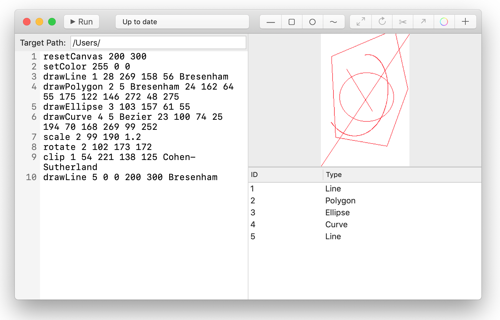

# CGDraw GUI

A macOS app that performs as a GUI of CGDraw. It supoorts mouse interactions on canvas. It is opensourced under GPLv3. The CGDraw CLI binary in the project is also opensourced. You may check it at [CGDraw](https://github.com/NSKernel/CGDraw).

## Build and run

Open the Xcode project. You can build and run it like any Xcode project. HOWEVER THE CODE IS WRITTEN FOR MACOS MOJAVE AND IS NOT GUARANTEED TO OPEN OR BUILD OR RUN ON ANY SYSTEM WITH OLDER VERISON.

## From mouse to code

CGDraw GUI will translate your mouse action in to code to the code box, so it is required that current code in the code box creates a valid canvas. If you edit the code, you will need to manually run the code to generate the canvas.

## Screenshot

## Usage

See [How-Tos](HOWTO.md)