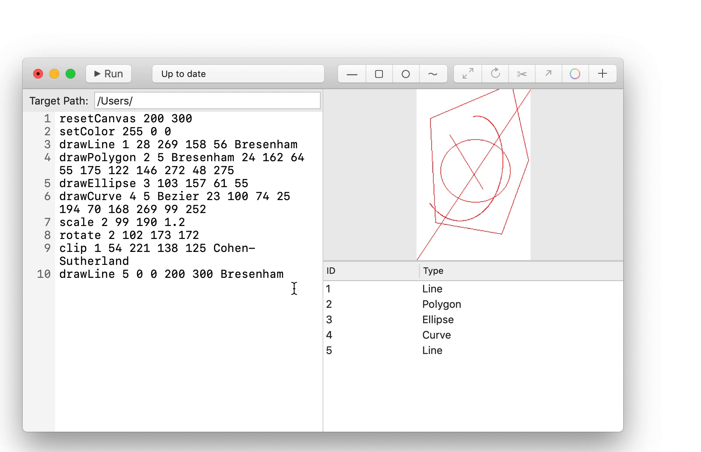

# CGDraw GUI

A macOS app that performs as a GUI of CGDraw. It supoorts mouse interactions on canvas.

## Build and run

Open the Xcode project. You can build and run it like any Xcode project. HOWEVER THE CODE IS WRITTEN FOR MACOS MOJAVE AND IS NOT GUARANTEED TO OPEN OR BUILD OR RUN ON ANY SYSTEM WITH OLDER VERISON.

## From mouse to code

CGDraw GUI will translate your mouse action in to code to the code box, so it is required that current code in the code box creates a valid canvas. If you edit the code, you will need to manually run the code to generate the canvas.

## Introduction to the user interface

You are welcomed by a refreshing beautiful user interface that is easy to use and understand.

Starting with the code box and run button. These will be the less important parts to this app since you are intended to use mouse interactions. But they are the key of canvas generation. You can use them if you need or simply ignore it if you prefer not writing any code.

Status bar shows the status of the canvs. You can find several status. "Waiting for a new canvas" means that you can click the new canvas button (introduced later) to create a new canvas and start drawing. "Up to date" means everything is ok and you can continue drawing. "Failed to execute" will never be there unless you have edited the code in the code box and introduced some errors. When you see "Failed to execute", you need to correct the errors and click "Run" to update the canvas to a valid state. Object list will be replaced by a console when you have errors. "Needs to update" means that you have edited the code and have to update the canvas by running the code.

Canvas, Draw Buttons, Object List and Action Buttons are the main way you interact with this app. When you have a canvas, you can click on the draw buttons (and also drag for algorithm selection) and draw. If you click an object in the object list, you can do actions to it like to scale it or rotate it. New Canvas and Set Color buttons are also in the Action Buttons.

## Usage

### Get started

To create a new canvas, click on the upper right button and enter the size. The default value is 100 x 100. You may also choose to remove the code in the code box to get a fresh start.

To set color, click on the set color button and type the color you want. The value for each RGB field is between 0 and 255, the text box will automatically fix a number that is too big.

### Algorithm Selection

CGDraw provides algorithms complied to the standard required by the class and teaching materials. You can select algorithm for lines, polygons, curves, and clipping. To select an algorithm, drag down the corresponding button and release on the algorithm you wish to use.

### Drawing

If you have a valid canvas, you can draw with your mouse. 

To draw a line, click the draw line button and draw on the canvas.

To draw a polygon, click the draw polygon button. You click on the start point on the canvas and click on each point. You end the polygon by a right click.

To draw an ellipse, click the draw ellipse button and draw.

To draw a curve, click the draw curve button. You click on the start point on the canvas and click on each control point. You end the curve by a right click.

### Editing

By selecting an object from the object list in the bottom right, you can edit that object.

To scale an object, select an object and click scale, set the center and scaling factor then click Set.

To rotate an object, select an object and click rotate, set the center and degree (from 0 to 359) then click Set.

To translate an object, select an object and click translate, then drag the translation vector.

To clip a line, select an object whose type is line and click clip. Then drag and set the clip window.

### Saving the canvas

You may save the graph with code. First you set the target path, just as the second parameter of the CLI CGDraw, then type `saveCanvas <file_name>` to save the canvas. You have to run the code after typing.

### Edit the code manually

Since CGDraw GUI is merely a mouse interactive interface of the CLI version of CGDraw, you may edit the code manually, like an ordinary IDE. However you do have to run the code each time you edit it to be able to use the GUI interactive environment again.

When there are errors in your code, the object panel will become the output console of CGDraw backend. You can check the error information there. Status bar will also show what is happening.

### Save and Open

The saving function provided by CGDraw GUI will ask to save if you have edited the code. The close window button will have a red dot inside if you have edited the code.

You can also open a previously saved code file by clicking File-Open or simply command + O

